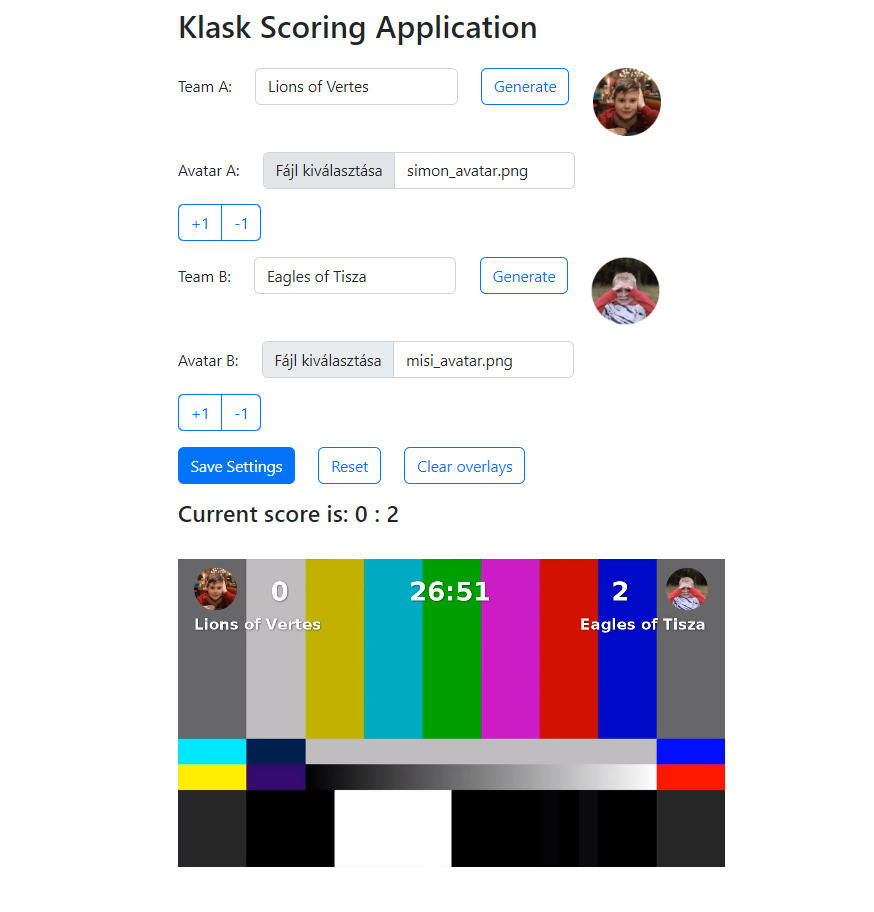

# Klask Scoring App

Created for the 2022 Ant Media Streaming Hackathon

What is Klask&trade;? [It is a captivating board game from Denmark](https://www.klaskgame.com/)

# Building

Clone `https://github.com/ant-media/ant-media-server-parent.git` and 
run `mvn clean install -DskipTests -Dgpg.skip=true` in the cloned parent project.

```
[INFO] Installing /home/ubuntu/ant-media-server-parent/pom.xml to /home/ubuntu/.m2/repository/io/antmedia/parent/2.6.0-SNAPSHOT/parent-2.6.0-SNAPSHOT.pom
[INFO] ------------------------------------------------------------------------
[INFO] BUILD SUCCESS
[INFO] ------------------------------------------------------------------------
[INFO] Total time:  3.641 s
[INFO] Finished at: 2022-11-19T18:12:08Z
```

Next change the working directory into the root of this repository and
run `mvn package`:

# Installing the Stamp plugin

Please follow the [installation instructions of the Streamtoolbox Stamp plugin here](https://streamtoolbox.com/ams-stamp).

# Installation

Make sure Ant Media Server is stopped:

`sudo systemctl stop antmedia.service`

Remove any previous exploded deployment, if you have installed a previous
version earlier:

`sudo rm -rf /usr/local/antmedia/webapps/KlaskApp`

Copy the war file to under the `webapps` folder:

`cp target/KlaskApp.war /usr/local/antmedia/webapps`

Start Ant Media Server:

`sudo systemctl start antmedia.service`

Navigate to the user interface in your browser: `http://yourserver:5080/KlaskApp` and the
administration user interface should show up:



# Developers

Balazs Jantek
Gabor Kovacs

# Notes

Klask&trade; is a registered trademark of Oy Marektoy Ltd. See https://www.klaskgame.com/
This project is not affiliated or endorsed by the company, we just found this game
the best for our demo purposes.